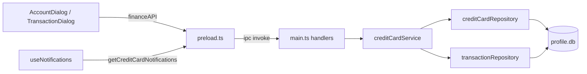

# Credit Card Management — Implementation Plan

## Goal

Add first-class credit card management to Laxmi:

- Credit card accounts with a credit limit, statement generation day, and bill due day.
- Charge transactions that deduct against the available limit.
- Reminders before statement generation to bring credit utilization under 10%.
- Reminders to pay before the bill due date.
- Payments modeled as transfers from a checking account into the credit card.

## Current State (what exists today)

- Credit cards already exist as `AccountSubType.Credit` in [src/types/account.ts](src/types/account.ts), but `AccountDialog` always saves them as `AccountType.Asset` (should be `Liability`) and stores no credit-specific fields.
- Transactions support `withdraw | deposit | transfer` in [src/types/transaction.ts](src/types/transaction.ts), and the schema has `transfer_account_id`, but transfer support is effectively non-functional (see the warning below).
- Notifications are aggregated in [renderer/src/hooks/useNotifications.ts](renderer/src/hooks/useNotifications.ts) from budgets + recurring; the pattern is `service.getNotifications()` -> IPC -> `AppNotification` union in [renderer/src/types/notifications.ts](renderer/src/types/notifications.ts).
- No background scheduler: reminders are computed on demand (on profile open / Home render), so credit reminders fit the same "compute when asked" model.
- Architecture is IPC -> Service -> Repository -> SQLite (better-sqlite3), with numbered migrations in [src/migrations/](src/migrations/) applied by [src/services/migration/migrationService.ts](src/services/migration/migrationService.ts) (current schema v13).

## Reality Check: Transfers Are Net-New, Not Reuse

The `transfer_account_id` column exists, but transfers are ignored in every read path, not just the UI:

- `findByAccountId` filters `WHERE account_id = ?` only ([src/repository/transaction/transactionRepository.ts](src/repository/transaction/transactionRepository.ts)) — the destination card never sees the incoming leg.
- `findWithFilter` and `aggregate` are also `account_id`-only, so Reports and CSV export silently ignore transfers.
- `computeBalance` returns the running sum unchanged for `Transfer` ([renderer/src/pages/accounts/AccountDetailPage.tsx](renderer/src/pages/accounts/AccountDetailPage.tsx)).

Treat transfers as "finish building", not "reuse".

**Scope decision (v1): card-only transfer path.** Implement just enough for credit card balances and the account detail view to reflect transfers correctly. Reports, CSV export, and budget aggregation remain transfer-unaware in v1 (documented gap). A future pass can make the shared `findWithFilter`/`aggregate` paths transfer-aware globally.

## Key Design Decisions

- **Credit detail storage: dedicated `credit_cards` table** (1:1 with `accounts` via `account_id`).
  - Chosen for typed access, validation, and a clean path to future statement-cycle storage.
  - Trade-off (acknowledged): `accounts.metadata` JSON would be higher reuse (no new table/repo, mirrors the investment `brokerage` precedent in [renderer/src/pages/accounts/AccountDialog.tsx](renderer/src/pages/accounts/AccountDialog.tsx)). We accept the extra table for clarity and extensibility.
- Model a credit card as `AccountType.Liability`. Balance is negative when money is owed.
  - A **charge** = `Withdraw` on the credit account (balance more negative, available limit shrinks).
  - A **payment** = `Transfer` from checking -> credit card (inflow to the card, balance moves toward 0).
- Keep transfers as a **single row** (`account_id` = source, `transfer_account_id` = destination) and fix balance computation to account for both legs. Matches the existing schema and avoids a double-entry rewrite. (If double-entry is ever needed, `portfolioTransactionService` already shows the atomic `db.transaction(() => …)` paired-write pattern.)
- `outstanding = max(0, -balance)`; `available = credit_limit - outstanding`; `utilization = outstanding / credit_limit`.
- **v1 simplification (acknowledged):** utilization and payment reminders use total current outstanding, not a projected per-statement-cycle balance. This matches what issuers report for utilization but does not model a revolved-balance projection. True statement-period balances are a future enhancement.
- Reminders are computed on demand from day-of-month fields (next statement date, next due date), mirroring the recurring date math.

## Data Flow

## Implementation Steps

### 0. Pre-refactors (do first to avoid copy-paste drift and silent render bugs)

- **Extract shared date utilities.** Move `createDateWithClampedDay`, `addDays`, `toDateOnly` (currently `private` in [src/services/recurringTransaction/recurringTransactionService.ts](src/services/recurringTransaction/recurringTransactionService.ts)) into a new `src/utils/dateUtils.ts`, and have both recurring and credit card services import them. Avoids two divergent month-clamping implementations.
- **Refactor `NotificationsPanel` helpers to exhaustive switches.** The current helpers use binary `if (budget) … else (assume recurring)` logic ([renderer/src/components/home/NotificationsPanel.tsx](renderer/src/components/home/NotificationsPanel.tsx)); `getTypeLabel` returns "Upcoming Expense" for anything non-budget. Convert `getTypeLabel`, `getDetailText`, `getRowClassName`, `getBadgeClassName`, `getAmountValue`, `getAmountClassName`, and the row `key` ternary to switch on `kind` so new credit kinds cannot fall through to the recurring branch.

### 1. Schema and types

- New migration `src/migrations/14-create_credit_cards.ts` creating:
  - `credit_cards(account_id INTEGER PRIMARY KEY REFERENCES accounts, credit_limit REAL NOT NULL, statement_day INTEGER NOT NULL, payment_due_day INTEGER NOT NULL, utilization_alert_threshold REAL NOT NULL DEFAULT 0.10, statement_reminder_lead_days INTEGER NOT NULL DEFAULT 5, payment_reminder_lead_days INTEGER NOT NULL DEFAULT 5, created_on TEXT, modified_on TEXT)`.
- New `src/types/creditCard.ts`: `CreditCardDetails`, `CreateCreditCardRequest`, `UpdateCreditCardRequest`, `CreditCardSummary` (account + outstanding, available, utilization, nextStatementDate, nextDueDate), and notification DTOs.

### 2. Repository

- `src/repository/creditCard/creditCardRepository.ts`: `upsert`, `findByAccountId`, `findAllActive` (join `accounts WHERE sub_type='credit' AND is_active=1` — this also makes any orphaned row from a deactivated account invisible), `deleteByAccountId`. Mirrors existing repository style (prepared statements, date serialization).

### 3. Service

- `src/services/creditCard/creditCardService.ts`:
  - `upsertCreditCardDetails(accountId, request)` with validation (limit > 0; days in 1..31).
  - `getCreditCardDetails(accountId)`.
  - `listCreditCardSummaries(referenceDate?)`: computes outstanding from transactions (including transfer legs), utilization, next statement/due dates.
  - `getNotifications(referenceDate?)`: emits
    - `credit_utilization` when `daysUntilStatement <= statement_reminder_lead_days` and `utilization > utilization_alert_threshold`.
    - `credit_payment_due` when `daysUntilDue <= payment_reminder_lead_days` and `outstanding > 0`.
  - Uses the extracted `dateUtils` for next day-of-month computation. Notification model mirrors `budgetService.getNotifications()` (compute-on-demand, filter to alert-worthy).

### 4. Transfers — card-only path (required for payments)

- `src/repository/transaction/transactionRepository.ts`: add `findAffectingAccount(accountId)` returning rows where `account_id = ? OR transfer_account_id = ?` (active only). Leave `findWithFilter`/`aggregate` unchanged in v1 (documented gap: Reports/CSV ignore transfers).
- Balance logic (service helper + renderer `computeBalance`): for account X, `+deposit` / `-withdraw` when `account_id=X`, `-amount` for transfers out (`account_id=X`), `+amount` for transfers in (`transfer_account_id=X`).
- `TransactionDialog`: when type is `Transfer`, show a "To account" select and set `transfer_account_id`; hide category/classification as appropriate.
- `AccountDetailPage`: load via the new affecting-account query and render incoming transfers with correct sign.

### 5. Account creation/deactivation for credit cards

- `AccountDialog` ([renderer/src/pages/accounts/AccountDialog.tsx](renderer/src/pages/accounts/AccountDialog.tsx)):
  - Set `account_type = AccountType.Liability` when `subType === Credit` (currently hardcoded to `Asset` in both create and edit branches).
  - When Credit is selected, show fields: Credit Limit, Statement Day, Payment Due Day (optional: utilization threshold + lead days, defaulted otherwise).
  - On save, call `createAccount`, then `upsertCreditCardDetails(accountId, ...)`. In edit mode, async-load existing details via `getCreditCard` to prefill.
- Account deactivation: `accountService.deactivateAccount` ([src/services/account/accountService.ts](src/services/account/accountService.ts)) currently cascades only to transactions. The `findAllActive` join (step 2) keeps orphaned credit rows invisible, so no hard cascade is strictly required for v1; optionally call `creditCardRepository.deleteByAccountId` there for cleanliness.

### 6. IPC wiring

- [main.ts](main.ts): instantiate `CreditCardServiceImpl`; register handlers `creditcard:upsert`, `creditcard:get`, `creditcard:list-summaries`, `creditcard:notifications`. Reuse the `budget:get-notifications` reference-date normalization (`referenceDate ? new Date(referenceDate) : undefined`).
- [preload.ts](preload.ts): expose `upsertCreditCard`, `getCreditCard`, `listCreditCardSummaries`, `getCreditCardNotifications` on `window.financeAPI`.
- [renderer/src/types/global.d.ts](renderer/src/types/global.d.ts): add the corresponding method signatures.

### 7. Frontend surfacing

- Extend `AppNotification` union in [renderer/src/types/notifications.ts](renderer/src/types/notifications.ts) with `credit_utilization` and `credit_payment_due`.
- [renderer/src/hooks/useNotifications.ts](renderer/src/hooks/useNotifications.ts): add `getCreditCardNotifications()` to the `Promise.allSettled` batch, map to notifications, and add ranks in `sortNotifications`.
- `NotificationsPanel` (post step-0 refactor): render the two new kinds (utilization % and amount due / due date).
- `AccountDetailPage`: for credit subtype, show a credit summary card (limit, outstanding, available, utilization %, next statement date, next due date) and an "Add Charge" / "Pay Card" affordance (Pay Card opens TransactionDialog pre-set to Transfer into this card).

### 8. Tests

- Service/repo unit tests cloned from existing patterns (e.g. [src/services/account/accountService.test.ts](src/services/account/accountService.test.ts), [src/repository/transaction/transactionRepository.test.ts](src/repository/transaction/transactionRepository.test.ts), [src/services/recurringTransaction/recurringTransactionService.test.ts](src/services/recurringTransaction/recurringTransactionService.test.ts)): utilization/outstanding math, next statement/due date computation, notification thresholds (boundaries at exactly 10% and exactly on lead-day).
- Transfer balance tests: charge reduces available; payment reduces outstanding on both accounts via `findAffectingAccount`.

## Reuse Assessment

- IPC / preload / global.d.ts wiring — High (mechanical); `budget:*` is a direct template.
- Service notification model — High; `budgetService.getNotifications()` maps 1:1.
- Test scaffolding — High; 23 existing test files with in-memory DB setup.
- Repository CRUD pattern — High; prepared statements + `mapRowTo*` + soft delete.
- Atomic paired-write (if double-entry ever needed) — High; `portfolioTransactionService` precedent.
- AccountDialog credit fields — Medium; Investment special-case is a template, but hardcoded `Asset` + sync load need changes.
- Date helpers — Medium (reuse-with-refactor); logic is right, access is `private` (extract first).
- NotificationsPanel rendering — Medium; reusable shell, but binary kind assumptions must become switches.
- Transfer read paths (`findByAccountId` / balance / reports) — Low; effectively net-new.

## Out of Scope (v1)

- Transfer-aware Reports, CSV export, and budget aggregation (card-only transfer path in v1).
- True per-statement-cycle balances, minimum payment, and interest/APR accrual.
- Automatic autopay (could later reuse `recurring_transactions` for transfer-based payments).
- Email/push reminders (in-app only, consistent with current notifications).

## Affected / New Files

- New: `src/utils/dateUtils.ts`, `src/migrations/14-create_credit_cards.ts`, `src/types/creditCard.ts`, `src/repository/creditCard/creditCardRepository.ts`, `src/services/creditCard/creditCardService.ts`.
- Modified: [src/services/recurringTransaction/recurringTransactionService.ts](src/services/recurringTransaction/recurringTransactionService.ts) (use extracted date utils), [main.ts](main.ts), [preload.ts](preload.ts), [renderer/src/types/global.d.ts](renderer/src/types/global.d.ts), [renderer/src/types/notifications.ts](renderer/src/types/notifications.ts), [renderer/src/hooks/useNotifications.ts](renderer/src/hooks/useNotifications.ts), [renderer/src/components/home/NotificationsPanel.tsx](renderer/src/components/home/NotificationsPanel.tsx), [renderer/src/pages/accounts/AccountDialog.tsx](renderer/src/pages/accounts/AccountDialog.tsx), [renderer/src/pages/accounts/AccountDetailPage.tsx](renderer/src/pages/accounts/AccountDetailPage.tsx), [renderer/src/pages/transactions/TransactionDialog.tsx](renderer/src/pages/transactions/TransactionDialog.tsx), [src/repository/transaction/transactionRepository.ts](src/repository/transaction/transactionRepository.ts), [src/services/account/accountService.ts](src/services/account/accountService.ts).
